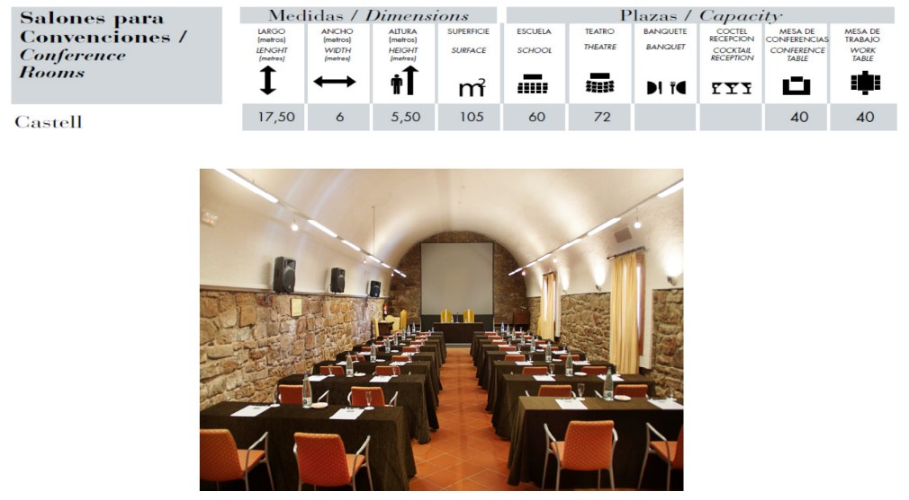
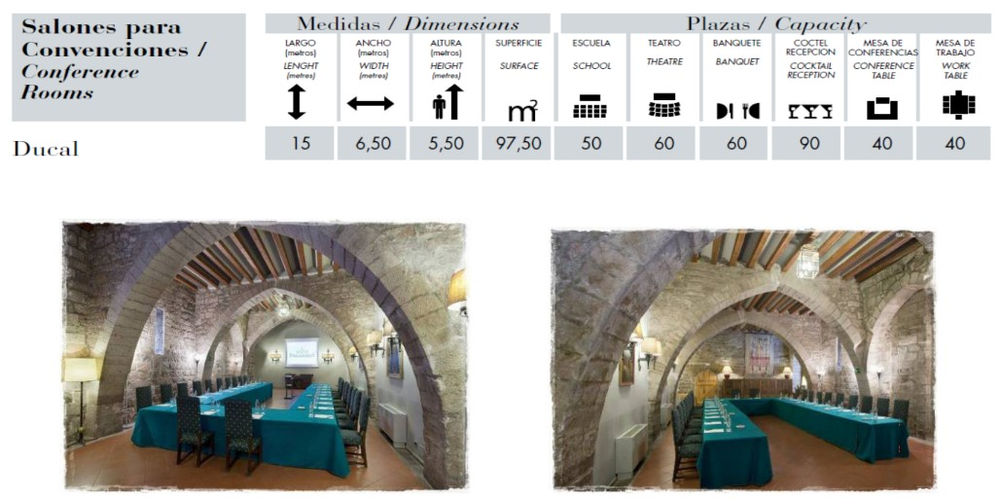
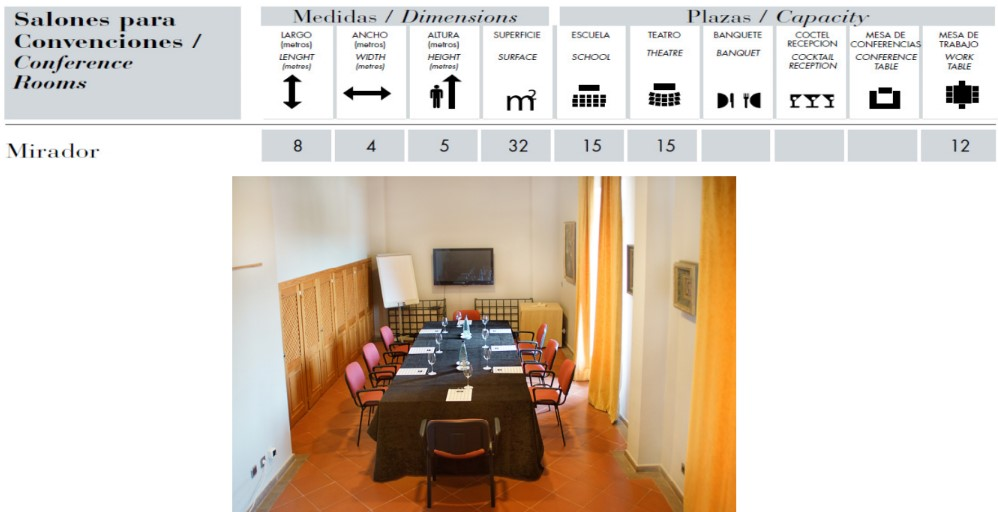
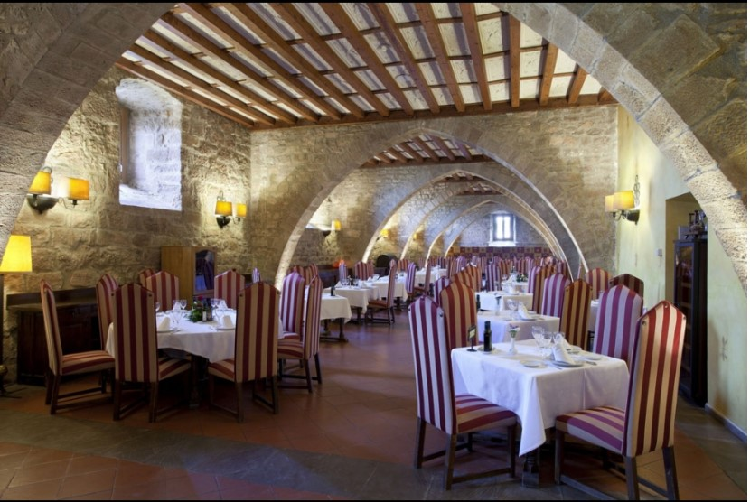
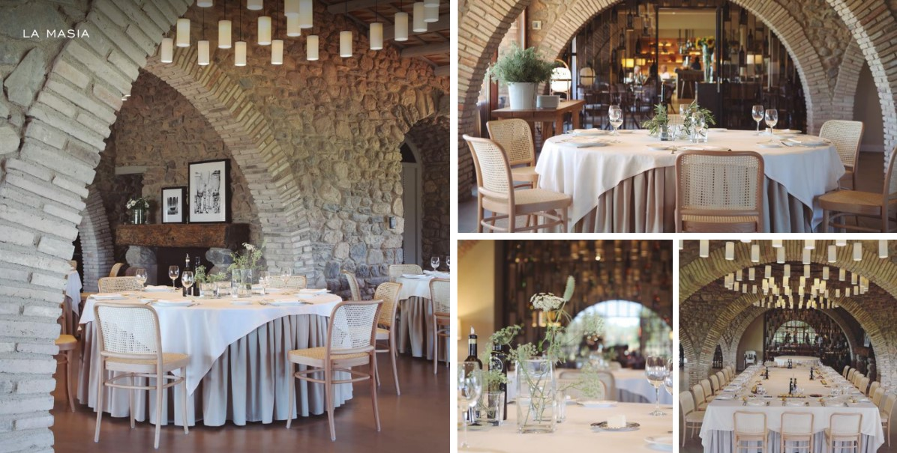
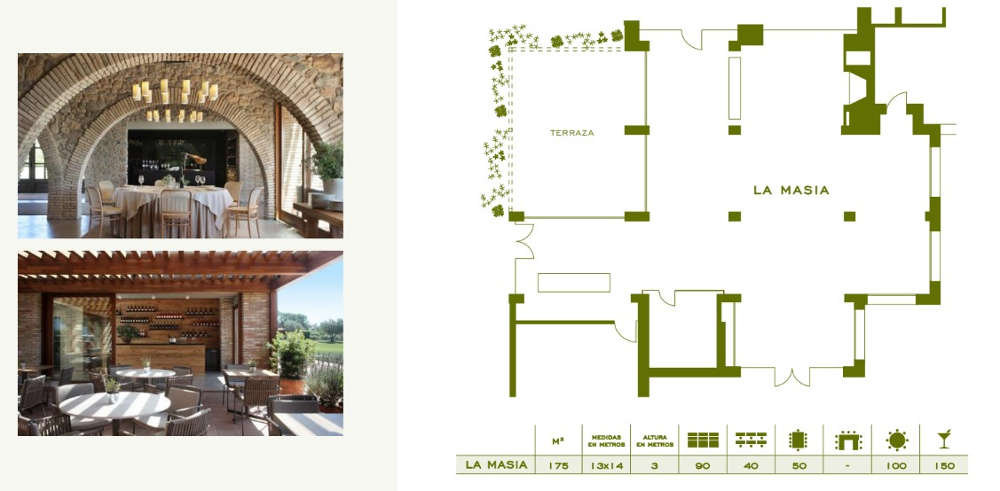

<script> 
    $(document).ready(function() { 
    $head = $('#header'); 
    $head.prepend('<A href = https://www.cuttingedge-events.com></A>') 
    }); 
</script> 


```{r setup, include=FALSE}
knitr::opts_chunk$set(echo = FALSE, message=FALSE, warning=FALSE)
```


```{r libraries}
library(readxl)
library(dplyr)
library(knitr)
library(timevis)

```


# **Parador Cardona**


**From 28th/29th to 31st January**

With a magical setting inside a 9th-century castle and boasting a 2nd-century tower, this Parador is straight out of fairytale and has panoramic views over the Catalonian countryside.

Interiors are faithful to the Cardona's history with Medieval styling complementing the castles vaulted ceilings, stone walls and gorgeous courtyards.

Dine in the Cardona's Medieval dining room which is fit for a king. Enjoy regional specialities which source the freshest local produce for an authentic taste of Catalonia.

Bedrooms have charming canopy beds and gothic features . Furnishings are inspired from the Catalan Medieval period and are highlighted by theatrical lighting and rich fabrics.

  * The hotel has 54 rooms. 
  * It is located 100km from Barcelona Airport


<br>
<br>

## Meeting Facilities 


Parador de Cardona has 3 meeting rooms as you can see:





If it could be possible to split the group between 2 meeting rooms we could use Castell +Ducal in theater style.

If the group needs to be together for the meeting we could use the dinning room, but we would need to use the same setup for the meeting and for the meals.



<br>

## Budget

<div class="budget">

<p> Group Package: Including accommodation based in double and triple rooms, Meeting rooms, AV, one coffee break, lunch including drinks and breakfast 
  <ul>
   Rates per person (for a minimum of 120pax): 150€ per night VAT inc
   
   Touristic tax: 1€ VAT inc per person and night
  </ul>
</p>

</div>

<style>

.budget{
background-color: #607D8B;
color: white;
padding: 10px;
border: 1px solid black;
margin-left: 5px;
border-radius: 5px;
font-style: italic;
}
</style>

<br>

*We are still waiting for the full board rates and for the Cardona auditorium answer to have a meeting venue option*

<br>
<br>


# **Hotel Món Sant Benet**

**Dates: from 13th to 17th January**


Hotel Món Sant Benet has modern facilities in the Medieval Monastery of Sant Benet de Bages. 

All rooms include a private terrace with views of the monastery and the Sant Llorenç del Munt i l'Obac Natural Park. They include a private bathroom with a bath and shower, air conditioning, heating, a flat-screen TV, and a minibar. All reservations include a visit to the Monastery, reservation in advance is needed.

Hotel Món Sant Benet has 3 restaurants, among which stands out the L'Ó, awarded a Michelin Star, offering creative and healthy versions of traditional cuisine.

  * The hotel has 87 rooms. 
  * It is located 70km from Barcelona Airport
  * It has a small conference centre, the plenary room will have capacity for the group in theater style.

  


## Meeting Facilities

Gran Montserrat Meeting room with natural daylight.

 


## Dinning space

La Fabrica room - the group can have their lunches and dinners in this room in exclusive


 

For the last evening, We can find in the hotel a very special restaurant: l'Ó, it is a one star Michelin restaurant that offers a mix of traditional and modern cuisine ealborated with fresh, seasonal ingredients.

 


## Budget

<div class="budget">

<p> Accommodation: 
  <ul>
    Double room for single use, breakfast included: 120€ VAT inc per night 
    
  Double room, breakfast included: 140€ VAT inc per night
    
  Touristic tax: 1€ VAT inc per person and night
  </ul>
</p>

<p> Meeting Facilities: 
  <ul>
  Gran Montserrat meeting room from 9.00h to 19.00h: 1500€ VAT inc
  
  Coffee break from: 12€ VAT inc
  
  Screen rental (4x2,5m)+ projector 8000 lumens: 530€ VAT inc
  
  Sound system: 250€ VAT inc
  
  Flipchart: 35€ VAT inc
  </ul>
</p>

<p> F&B: 
  <ul>
  Lunch or Dinner in La Fabrica room, 3 courses menu including non alcoholic drinks, from: 37,50€ VAT inc
  
  Lunch or dinner in La Fabrica room, buffet lunch including non alcoholic drinks, from 49€ VAT inc
  
  Restaurant Ó- tasting menu including drinks, from: 81,50€ VAT inc 
  
  </ul>
</p>

</div>

<style>

.budget{
background-color: #607D8B;
color: white;
padding: 10px;
border: 1px solid black;
margin-left: 5px;
border-radius: 5px;
font-style: italic;
}
</style>

<br>

*The accomodation rates are valid only if three nights are booked*

<br>

<br>
<br>


# **Hotel Peralada** 

**From 29th to 31st January**


Hotel Peralada Wine Spa and Golf has rooms with views over the resort golf course.  The hotel also offers an outdoor seasonal pool.

Rooms at the Peralada are modern and feature bright décor. All rooms have free Wi-Fi access.

A range of treatments and massages are available in the Peralada’s wine spa.

The Olivera restaurant features a terrace and serves Mediterranean cuisine. 

  * The hotel has 64 rooms. 
  
  We will have:
  
  49 twin rooms (98pax)
  
  8 bedrooms with king size + extra bed (16 pax)
  
  6 Double room for single use (king size bed)(6 pax)
  
  
  *It is one room already booked by an individual*
  
  * It is located 165km from Barcelona Airport


  


## Meeting Facilities

Plenary room: **Albera** with natural lighting and a a terrace. 

It has capacity for 150 pax in theatre style

It is including basic AV:
  * Projector
  * Screen
  * Sound system
  * Mineral water
  * One Hand microphone
  * One flipchart
  * Lectern or high table


## Dining spaces

The hotel offers different restaurants and bars but the one that we will suggest for the lunches and the first dinner (29th) is ***Restaurant La Masia**. It has natural lighting and views to the golf course and access to a terrace.





<br>


The 30th evening we propose a farewell dinner at a very special space: **Castell de Perelada**
specifically at the room **El Pavelló del castell**.
This beautiful castle is located 1,5km from the hotel and it belongs to the same property, so the hotel will offer free of charge transfer from the hotel to the dinner and back.

The Casino de Perelada is located inside the Castle and the hotel will offer us a free entrance the 30th night after dinner.


The Pavello room has beautiful views to the castle and it is surrounded by the gardens.


## Budget

<div class="budget">

<p> Accommodation: 
  <ul>
    Double room for single use, breakfast included: 155€ VAT inc per night 
    
  Double room, breakfast included: 170€ VAT inc per night
    
  Touristic tax: 2,48€ VAT inc per person and night
  </ul>
</p>

<p> Meeting Facilities: 
  <ul>
    Albera Meeting room - full day rental: 550€ VAT inc (including AV as menitioned)

  </ul>
</p>

<p> F&B: 
  <ul>
    Lunch at the hotel: 3 courses menu, including non alcoholic drinks from: 45€ VAT inc
    
  29th Dinner at the hotel:  3 courses menu, including drinks from: 60€ VAT inc
    
 30th Dinner at Castell de Perelada:  3 courses menu, including drinks from: 66€ VAT inc

  </ul>
</p>


</div>

<style>

.budget{
background-color: #607D8B;
color: white;
padding: 10px;
border: 1px solid black;
margin-left: 5px;
border-radius: 5px;
font-style: italic;
}
</style>

<br>

*This rates will not include the hotel's exclusivity*

*Optional exclusivity fee: 6500€ VAT inc - including all th services quoted above + the Spa, meeting rooms and both restaurants*

<br>
<br>

# **Amaze your clients!!**

<div class="client_offer">

<p>Didn't you just love our presentation ? Our first goal here at _**Cutting Edge Events**_ is to help you **win** this business. You will most likely now collate the information contained in this website and make your own presentation
to show your client<br>

<p>Why not leverage our technology, and present your client with the same format ? As a **totally free service**, we offer you the possibility of doing the work for you</p>

<p> We will: 
  <ul>
    * Follow your instructions to add anything you want to be in your presentation, and delete anything that you don't consider relevant
    * Include your logo and company details, and remove all our company details
    * We can even change some colors to mimic your corporate identity
    * We will send you the new link, and it will look as if it was your work
  </ul>
</p>
</div>

<style>

.client_offer{
background-color: #ee7600;
color: white;
padding: 10px;
border: 1px solid black;
margin-left: 5px;
border-radius: 5px;
font-style: italic;
}
</style>


